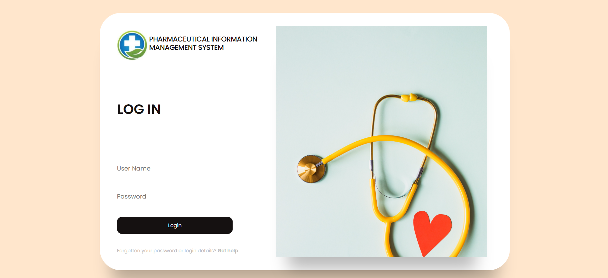

# 💊 Pharmaceutical Management System (Web-Based)



## 📌 Project Overview

This is a web-based Pharmaceutical Management System that provides modules to manage:

- 👥 User Accounts and Roles (Admin, Staff)
- 🧪 Supplier Records
- 💊 Medicine/Item Inventory

The system includes:
- Login system with session management
- CRUD operations for each module
- Basic search and filter features
- Responsive frontend using HTML/CSS
- PHP-MySQL backend with secure queries

---

## 🧱 Technology Stack

| Layer         | Technology Used         |
|---------------|--------------------------|
| Frontend      | HTML, CSS, JavaScript    |
| Backend       | PHP                      |
| Database      | MySQL                    |
| Styling/UX    | Bootstrap                |

---

---

## 🚀 How to Run

1. Clone or download the project.

2. Create a MySQL database:

```sql
CREATE DATABASE pharma_db;

```
3. Import the provided SQL file:
USE pharma_db;
SOURCE pharma_db.sql;

4. Configure db.php with your MySQL credentials.

5. Start a local server using XAMPP / WAMP / MAMP and place the project in the /htdocs directory.

6. Visit:
http://localhost/pharma-management/

🎯 Key Features
✅ Secure Login and Logout
✅ Add, View, Edit, Delete Suppliers
✅ Add, View, Edit, Delete Items
✅ Add and Manage Users
✅ Search functionality
✅ Responsive layout


